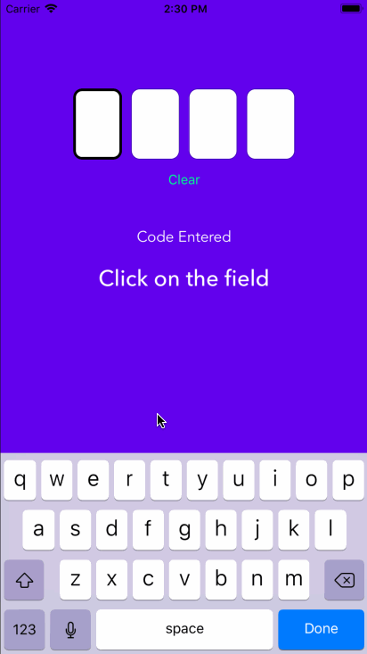

# VRCodeView

[](https://cocoapods.org/pods/VRCodeView)
[](https://cocoapods.org/pods/VRCodeView)
[](https://cocoapods.org/pods/VRCodeView)
[](https://cocoapods.org/pods/VRCodeView)

**VRCodeView** is a light-weight, highly customizable and beautiful subclass of UIView that allows the user to enter verification code characters one textfield at a time, and move back and forth smoothly.

<div style="text-align:center;"></div>

## Example

To run the example project, clone the repo, and run `pod install` from the Example directory first.

<div style="text-align:center;"></div>

## Compatibility

VRCodeView is compatible with **Swift 4.1** & **iOS 10+**.

## Installation

VRCodeView is available through [CocoaPods](https://cocoapods.org). To install
it, simply add the following line to your Podfile:

```ruby
pod 'VRCodeView'
```

## Author

Vatsal Rustagi, vatsalr23@gmail.com

## License

VRCodeView is available under the MIT license. See the LICENSE file for more info.
