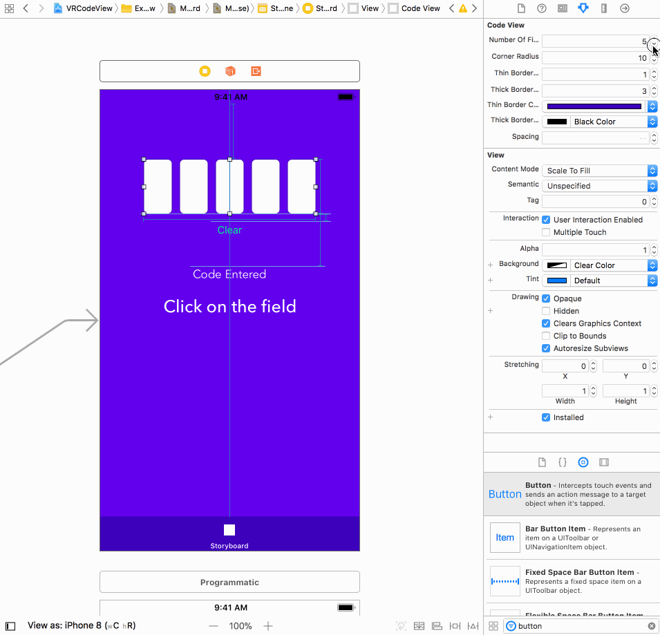

# VRCodeView

[](https://cocoapods.org/pods/VRCodeView)
[](https://cocoapods.org/pods/VRCodeView)
[](https://cocoapods.org/pods/VRCodeView)
[](https://cocoapods.org/pods/VRCodeView)

**VRCodeView** is a light-weight, highly customizable and beautiful subclass of UIView that allows the user to enter verification code characters one textfield at a time, and move back and forth smoothly.

<p align="center"></p>

## Example

To run the example project, clone the repo, and run `pod install` from the Example directory first.

<p align="center"></p>

## Compatibility

VRCodeView is compatible with **Swift 4.1** & **iOS 10+**.

## Installation

VRCodeView is available through [CocoaPods](https://cocoapods.org). To install
it, simply add the following line to your Podfile:

```ruby
pod 'VRCodeView'
```

## Initialize with Storyboard

1) Drag a UIView on the storyboard.
2) Subclass from **VRCodeView** using the *Identity Inspector*
3) Use the *Attributes Inspector* to make changes and see it live on the storyboard.

<p align="center"></p>

## Initialize with Code

It's as simple as initalizing a regular UIView!

```swift

var codeView: VRCodeView?

...

override func viewDidLoad() {
      super.viewDidLoad()

  let width: CGFloat = 200
  let codeViewFrame = CGRect(x: view.frame.midX - width/2,
                             y: 150,
                             width: width,
                             height: 65)

  codeView = VRCodeView(frame: codeViewFrame)
  codeView?.delegate = self
  
  // ... Other setup
}
```

## Delegate Usage
There is only one delegate method:

```swift
public protocol VRCodeViewDelegate: AnyObject {
  func didCompleteCodeEntry(codeEntered: String)
}
```
> This methods gets called as soon as all the fields are filled up. It contains the code that the user entered.
> Note: Make sure to set the delegate in order to use this method!!

## Usage
### Textfield properties
```swift
codeView?.font = UIFont(name: "Avenir", size: 20)!
codeView?.spacing = 5
codeView?.numberOfFields = 3
```

### Textfield border properties
```swift
codeView?.cornerRadius = 10
codeView?.thickBorderColor = UIColor.purple
codeView?.thinBorderColor = UIColor.purple
codeView?.thickBorderWidth = 2.5
codeView?.thinBorderWidth = 1.0
```

### Keyboard properties
```swift
// Type . and see the available options!
codeView?.allowedCharacters = .decimalDigits
codeView?.autocorrectionType = .no
codeView?.spellCheckingType = .no
codeView?.keyboardType = .decimalPad
codeView?.returnKeyType = .go
```

> Note: **allowedCharacters** property is of type CharacterSet therefore you can make your own custom character set and assign it to this property.

### Shadow Workaround
```swift
codeView?.backgroundColor = nil
codeView?.layer.shadowColor = UIColor.black.cgColor
codeView?.layer.shadowOffset = CGSize(width: 0, height: 0)
codeView?.layer.shadowRadius = 10.0
codeView?.layer.shadowOpacity = 0.4
```

### Other properties and methods
> **.code** : Returns a string of entered characters.
```swift
@IBAction func showCurrentLetters(_ sender: UIButton) {
  print(codeView?.code)
}
```

> **isUpperCased** : When set to true the view will convert any character to corresponding uppercased character.
```swift
codeView?.isUpperCased = true
```

> **.hasText** : Returns a boolean value indicating if the view has any characters.
```swift
guard codeView?.hasText else {
  return 
}
// Do something
```

> **.clear()** : Removes all entered characters.
```swift
@IBAction func clearButtonPressed(_ sender: UIButton) {
  codeView?.clear()
}
```

### Default values for each property
<table style="width:50%" >
  <tr>
    <td align = "center">
      Property
    </td>
    <td align="center">
      Default Value
    </td>
  </tr>
  <tr>
    <td>
      allowedCharacters
    </td>
    <td align="center">
      CharacterSet.decimalDigits
    </td>
  </tr>
  <tr>
    <td>
      keyboardType
    </td>
    <td align="center">
      .asciiCapable
    </td>
  </tr>
  <tr>
    <td>
      returnKeyType
    </td>
    <td align="center">
      .done
    </td>
  </tr>
  <tr>
    <td>
      autocorrectionType
    </td>
    <td align="center">
      .no
    </td>
  </tr>
  <tr>
    <td>
      spellCheckingType
    </td>
    <td align="center">
      .no
    </td>
  </tr>
  <tr>
    <td>
      numberOfFields
    </td>
    <td align="center">
      0
    </td>
  </tr>
  <tr>
    <td>
      cornerRadius
    </td>
    <td align="center">
      3.0
    </td>
  </tr>
  <tr>
    <td>
      thinBorderWidth
    </td>
    <td align="center">
      1.0
    </td>
  </tr>
  <tr>
    <td>
      thickBorderWidth
    </td>
    <td align="center">
      3.0
    </td>
  </tr>
  <tr>
    <td>
      thinBorderColor
    </td>
    <td align="center">
      .black
    </td>
  </tr>
  <tr>
    <td>
      thickBorderColor
    </td>
    <td align="center">
      .black
    </td>
  </tr>
  <tr>
    <td>
      spacing
    </td>
    <td align="center">
      10
    </td>
  </tr>
  <tr>
    <td>
      font
    </td>
    <td align="center">
      UIFont.systemFont(ofSize: 16, weight: .semibold)
    </td>
  </tr>
  <tr>
    <td>
      isUpperCased
    </td>
    <td align="center">
      false
    </td>
  </tr>
</table>

## Author

Vatsal Rustagi, vatsalr23@gmail.com

## License

VRCodeView is available under the MIT license. See the LICENSE file for more info.
